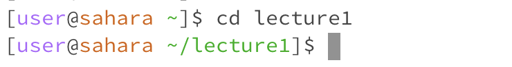
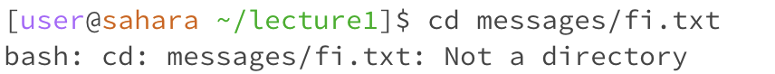
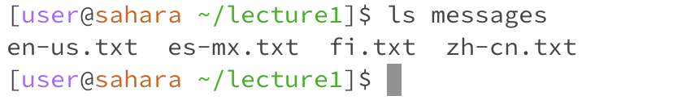
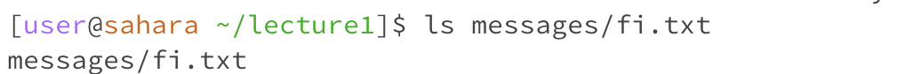
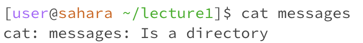

# CSE 15L Lab Report 1
## by Camille Saldajeno
___

* The working directory is `/home`
* Running `cd` with no arguments takes you to the home directory
* cd changes your working directory to the directory/file you input as the argument, but since there is no argument or error, `cd` goes to the default home directory and returns a new prompt.
* The output is not an error.

* After running cd lecture1, the the working directory is now `/home/lecture1`
* The working directory is changed to the subdirectory of the home directory, `lecture1`. `~` represents the home directory.
* The output is not an error.

* The working directory is `/home/lecture1`
* `cd` is used to change the working directory, and since the argument is a file instead of a directory, the output results in an error, stating that the argument is `not a directory`
* The output is an error, since `cd` expects a directory, not a file

* The working directory is `/home/lecture1`
* Running `ls` with no arguments outputs a list of the current directory's contents, in this case the files in `lecture1`
* The output is not an error

* The working directory is `/home/lecture1`
* `messages` is an existing subdirectory of lecture1, so running `ls messages` lists the content, which, in this case, are text files, in `messages`. 
* The output is not an error

* The working directory is `/home/lecture1`
* `ls` is used to list the names of the contents of a directory and since there's no other files in `fi.txt`, the output is just the argument itself. If the working directory was `/home/lecture1/messages` and the agrument was only `ls`, then it would've printed all the txt files in messages, including `fi.txt`.
* The output is not an error

* The working directory is `/home/lecture1`
* `cat` is used to read and output the contents of a file, so when it's not given a specific file as an argument, it just waits for an input, reprinting the same input until the command is forcibly ended.
* it is not necessarily an error since the output doesn't specify it is; instead of an 'error' it is waiting for another input until foricbly ended by using `ctrl + D` for example.

* The working directory is `/home/lecture1`
* the `cat` command is used to print the contents of a file, usually a text file, so running `cat messages`, where `messages` is a subdirectory/directory, results in a warning-like output that tells the user that `messages` is a directory and not what the cat command expects or is used for
* The output is not a formal programming error and more of a diagnostic message, warning that `messages` isn't a file the cat command expects or is used for.

* The working directory is `/home/lecture1`
* the `cat` command is used to read and print the contents of a file, which in this case is `fi.txt`, printing its text content, Hei maailma.
* The output is not an error.
